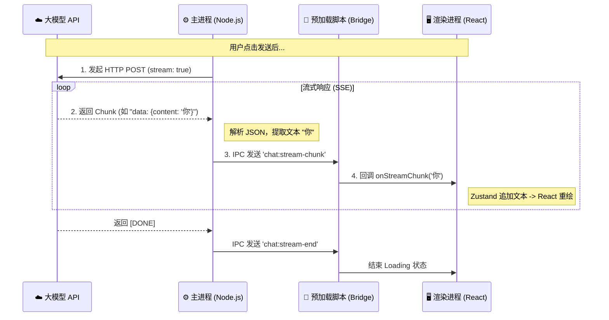

# Electron AI 流式数据全链路解析 (Data Flow Explained)

本文档详细讲解了从大模型 API 返回数据，到最终在用户屏幕上渲染出“打字机效果”的完整数据流转过程。

## 1. 全景数据流 (The Big Picture)

整个过程可以分为 4 个阶段，数据像接力棒一样在不同进程间传递。



---

## 2. 详细拆解 (Step by Step)

### 阶段一：主进程获取源数据 (Raw Data)
*   **位置**: `src/main/index.js`
*   **动作**: 使用 `net.request` 发起请求。
*   **关键点**: 大模型返回的不是一次性的 JSON，而是 **SSE (Server-Sent Events)** 格式的文本流。

**数据长这样 (Buffer/String):**
```text
data: {"id":"...","choices":[{"delta":{"content":"你"}}]}

data: {"id":"...","choices":[{"delta":{"content":"好"}}]}
```

**代码解析**:
```javascript
response.on('data', (chunk) => {
  // 把二进制 chunk 转成字符串
  const lines = chunk.toString().split('\n')
  for (const line of lines) {
    if (line.startsWith('data: ')) {
      // 去掉前缀，拿到 JSON 字符串
      const jsonStr = line.slice(6)
      // 解析出核心文本 "你"
      const content = JSON.parse(jsonStr).choices[0]?.delta?.content
      // 发送给下一棒
      sender.send('chat:stream-chunk', content)
    }
  }
})
```

### 阶段二：穿越 IPC 边界 (The Bridge)
*   **位置**: `src/preload/index.js`
*   **动作**: 充当“传声筒”。因为安全原因，渲染进程不能直接监听 IPC，必须通过 Preload 暴露的安全 API。

**代码解析**:
```javascript
// Preload 暴露给 window 的 API
onStreamChunk: (callback) => {
  // 收到主进程的消息，立即调用前端传入的回调函数
  ipcRenderer.on('chat:stream-chunk', (_event, chunk) => callback(chunk))
}
```

### 阶段三：前端状态更新 (State Update)
*   **位置**: `src/renderer/src/App.jsx` (Zustand Store)
*   **动作**: 将收到的碎片字符拼接到最后一条消息上。这是“打字机效果”的本质。

**关键逻辑 (Zustand)**:
```javascript
updateLastMessage: (chunk) => set(state => {
  const msgs = [...state.messages]
  // 找到最后一条消息 (即 AI 正在生成的那条)
  const lastMsg = msgs[msgs.length - 1]
  // ★ 核心：字符串拼接 ( Append )
  lastMsg.content += chunk 
  // 触发 React 更新
  return { messages: msgs }
})
```

### 阶段四：React 组件渲染 (Rendering)
*   **位置**: `MessageBubble` 组件
*   **动作**: 当 `content` 发生变化（哪怕只多了一个字），React 都会重新渲染该组件。
*   **魔法**: `react-markdown` 会实时解析新的 Markdown 字符串。

**假设数据流**:
1.  `content = "你"` -> 渲染: `<div>你</div>`
2.  `content = "你好"` -> 渲染: `<div>你好</div>`
3.  `content = "你好 **"` -> 渲染: `<div>你好 **</div>` (Markdown 解析器等待闭合)
4.  `content = "你好 **世界**"` -> 渲染: `<div>你好 <strong>世界</strong></div>` (粗体突然出现)

---

## 3. 性能隐患与优化 (Advanced)

你可能会问：**“每秒更新几十次 React 组件，不会卡吗？”**

### 现状 (MVP)
目前我们是**来一个渲染一个**。如果 AI 吐字极快（如 Groq 引擎，每秒 500 token），React 可能会因为重绘过于频繁而掉帧。

### 优化方案 (Throttling / Batching)
在 PRD v3.0 中我们提到了 **IPC 节流**。

**在主进程做缓存**:
```javascript
let buffer = ''
response.on('data', (chunk) => {
  buffer += parse(chunk)
  // 每 50ms 才发送一次，而不是立刻发送
  if (now - lastSend > 50) {
    sender.send('chat:stream-chunk', buffer)
    buffer = ''
  }
})
```
这样前端每秒最多只重绘 20 次 (1000ms / 50ms)，既保证了流畅度，又降低了 CPU 占用。

---
*Created by Trae AI Assistant*
