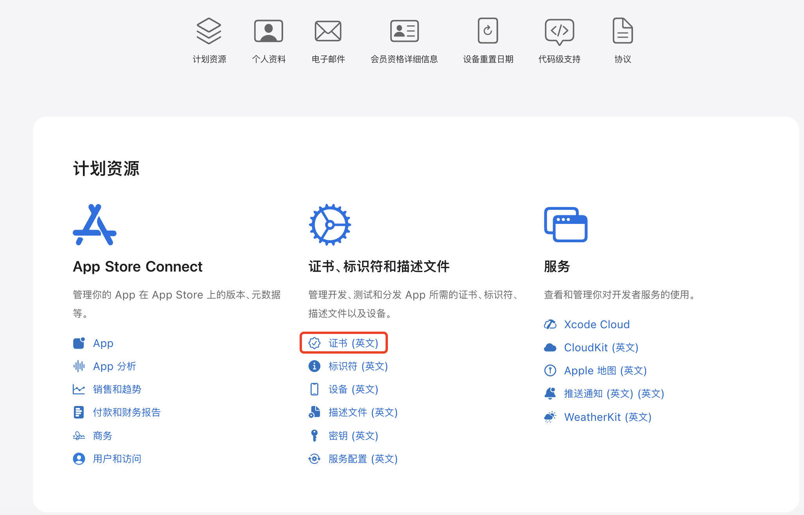
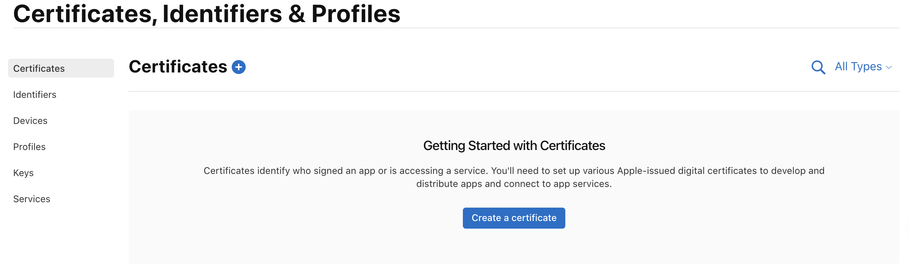
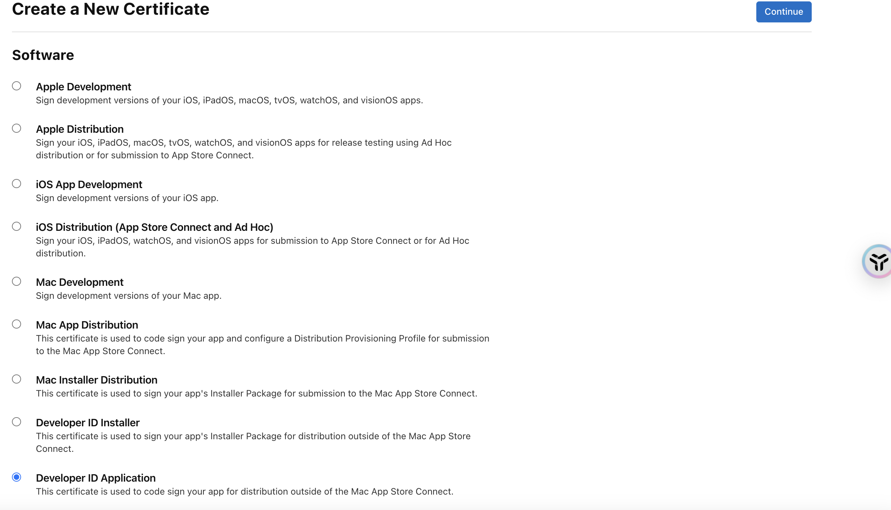
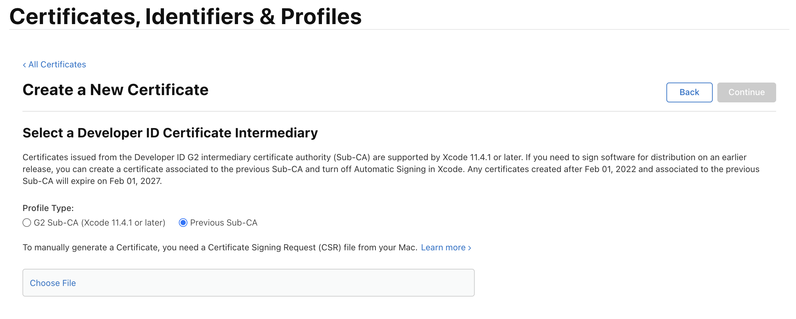

# Electron macOS 代码签名与公证指南 (Code Signing & Notarization)

要让您的 macOS 应用支持**自动更新**，并且在用户电脑上安装时不显示“文件已损坏”或“恶意软件”警告，必须进行**代码签名**和**苹果公证**。

本指南将引导您完成从证书导出到自动化打包的全过程。

## 1. 准备工作

### 1.1 获取证书 (Certificate)
1.  登录 [Apple Developer Account](https://developer.apple.com/account)。
2.  进入 **Certificates, Identifiers & Profiles**。
    
    

3.  点击左侧菜单的 **Certificates**。
    
    

4.  点击蓝色的 **+** 创建新证书。
5.  **关键步骤**：在 "Software" 栏目下，找到并勾选 **Developer ID Application**。
    *   *说明文字通常是：This certificate is used to code sign your app for distribution outside of the Mac App Store Connect.*
    *   *注意：千万不要选 "Apple Distribution" 或 "Mac App Distribution"，那些是上架 App Store 用的。*
    *   **关于 Services 栏目**：下方的 "Services" 列表（如 Apple Pay, Push Notification 等）**无需勾选任何项**，直接忽略。
    
    

6.  点击右上角的 Continue。
    
    

7.  **生成 CSR 文件 (Certificate Signing Request)**：
    *   在您的 Mac 上打开“钥匙串访问 (Keychain Access)”。
    *   点击菜单栏左上角的 **钥匙串访问** > **证书助理** > **从证书颁发机构请求证书**。
    *   **用户电子邮件**：填您的 Apple ID。
    *   **常用名称**：随意填（如 "Dev Key"）。
    *   **CA 电子邮件**：**留空**。
    *   **请求是**：选择 **存储到磁盘 (Saved to disk)**。
    *   点击继续，将文件保存到桌面。

8.  回到网页，Profile Type 选择 **G2 Sub-CA**（推荐）或 Previous Sub-CA。
9.  点击 **Choose File**，上传刚才生成的 CSR 文件。
10. 点击 **Continue**，下载生成的 `.cer` 文件。
11. 双击 `.cer` 文件导入到 macOS 的“钥匙串访问”。

### 1.2 导出 .p12 文件
1.  在“钥匙串访问”中找到刚才导入的证书（通常显示为 `Developer ID Application: Your Name (Team ID)`）。
2.  右键点击证书，选择 **导出 (Export)**。
3.  文件格式选择 `.p12`，保存为 `certs.p12`（建议放在项目根目录，但**不要提交到 git**）。
4.  设置一个导出密码，并牢记它。

### 1.3 获取 App 专用密码 (App-Specific Password)
为了进行公证，需要提供 Apple ID 凭证，但不能使用您的登录密码。
1.  登录 [appleid.apple.com](https://appleid.apple.com)。
2.  在 **App-Specific Passwords** 区域，点击生成。
3.  命名为 `electron-notarize`，复制生成的密码（格式如 `xxxx-xxxx-xxxx-xxxx`）。

### 1.4 获取 Team ID
1.  在 Apple Developer Account 首页右上角，或者 Membership 页面，找到您的 **Team ID**（通常是 10 位字符，如 `8A2B3C4D5E`）。

---

## 2. 项目配置

### 2.1 安装公证依赖
在项目根目录运行：
```bash
pnpm add -D @electron/notarize dotenv
```

### 2.2 创建公证脚本
在项目根目录（或 `build/` 目录）下创建文件 `scripts/notarize.js`：

```javascript
require('dotenv').config();
const { notarize } = require('@electron/notarize');

exports.default = async function notarizing(context) {
  const { electronPlatformName, appOutDir } = context;  
  if (electronPlatformName !== 'darwin') {
    return;
  }

  const appName = context.packager.appInfo.productFilename;

  // 检查环境变量是否存在
  if (!process.env.APPLE_ID || !process.env.APPLE_ID_PASSWORD || !process.env.APPLE_TEAM_ID) {
    console.warn('Skipping notarization: APPLE_ID, APPLE_ID_PASSWORD or APPLE_TEAM_ID not set');
    return;
  }

  console.log(`Notarizing ${appName}...`);

  await notarize({
    appBundleId: 'com.trae.ai.assistant', // 必须与 package.json 中的 appId 一致
    appPath: `${appOutDir}/${appName}.app`,
    appleId: process.env.APPLE_ID,
    appleIdPassword: process.env.APPLE_ID_PASSWORD,
    teamId: process.env.APPLE_TEAM_ID,
  });

  console.log(`Done notarizing ${appName}`);
};
```

### 2.3 修改 package.json
在 `build` 配置中添加 `afterSign` 钩子：

```json
"build": {
  "appId": "com.trae.ai.assistant",
  "afterSign": "scripts/notarize.js", 
  "mac": {
    "target": ["dmg", "zip"],
    "hardenedRuntime": true,
    "gatekeeperAssess": false,
    "entitlements": "build/entitlements.mac.plist",
    "entitlementsInherit": "build/entitlements.mac.plist"
  }
}
```

*注意：您可能还需要创建一个 `build/entitlements.mac.plist` 文件来声明权限（如麦克风、摄像头等），否则 hardenedRuntime 可能会导致 App 崩溃。*

---

## 3. 打包命令

为了安全起见，不要将密码硬编码在代码里。建议创建一个 `.env` 文件（**加入 .gitignore**），或者在打包时动态注入。

### 方法 A: 使用 .env 文件 (推荐本地开发)
在项目根目录创建 `.env`：
```env
# 签名配置
CSC_LINK=./certs.p12
CSC_KEY_PASSWORD=your_p12_export_password

# 公证配置
APPLE_ID=your_email@example.com
APPLE_ID_PASSWORD=xxxx-xxxx-xxxx-xxxx
APPLE_TEAM_ID=YOUR_TEAM_ID
```

然后修改 `package.json` 的 build 脚本：
```json
"scripts": {
  "build": "electron-vite build && electron-builder" 
  // electron-builder 会自动读取 .env (如果配置了 dotenv) 
  // 或者使用: "build": "source .env && electron-vite build && electron-builder"
}
```

### 方法 B: 命令行注入 (CI/CD 推荐)
```bash
export CSC_LINK="./certs.p12"
export CSC_KEY_PASSWORD="your_password"
export APPLE_ID="user@example.com"
export APPLE_ID_PASSWORD="xxxx-xxxx-xxxx-xxxx"
export APPLE_TEAM_ID="YOUR_TEAM_ID"

pnpm run build
```

---

## 4. 验证签名

打包完成后，您可以使用以下命令验证 `.app` 是否签名成功：

```bash
codesign --verify --deep --strict --verbose=2 dist/mac-arm64/AI\ Assistant.app
```

如果输出 `valid on disk` 和 `satisfies its Designated Requirement`，说明签名成功。

验证公证状态（通常 electron-builder 如果没报错就是成功了），也可以尝试直接运行打包出来的 App，如果 Gatekeeper 没有拦截，直接允许运行，说明公证生效。
